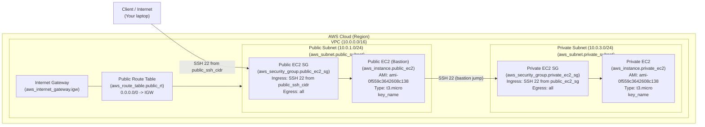

## Simple VPC With Public & Private EC2 (Terraform)

This project creates a **simple AWS network** using Terraform:

- **1 VPC**
- **1 public subnet** and **1 private subnet**
- **Internet Gateway + route table** for the public subnet
- **Security groups** for controlled SSH access
- **1 EC2 instance in the public subnet** (reachable from the internet)
- **1 EC2 instance in the private subnet** (reachable only from the public EC2)

Designed to be **close to AWS Free Tier** for short-lived labs and learning.

---

## Quick Start

- **1. Configure variables**
  - Edit `terraform.tfvars` and set:
    - `project_name` – any label (e.g. `"Simple-Infra-1"`).
    - `region` – e.g. `"ap-south-1"`.
    - `key_name` – **existing EC2 key pair name** in that region.
    - `vpc_cidr_block`, `pub_sub_1a_cidr`, `pri_sub_3a_cidr` – CIDR ranges you want to use.

- **2. Initialize Terraform**

  ```bash
  terraform init
  ```

- **3. Create a plan**

  ```bash
  terraform plan -out=tfplan
  ```

- **4. Apply the plan**

  ```bash
  terraform apply tfplan
  ```

- **5. SSH into instances**
  - From your machine:
    - `ssh -i <path-to-pem> ec2-user@<PUBLIC_EC2_PUBLIC_IP>`
  - From the public EC2 to the private EC2:
    - Either copy the key to the public instance (lab only), or use SSH agent forwarding as described later in this README.

- **6. Destroy when done (to avoid costs)**

  ```bash
  terraform destroy
  ```

---

## AWS Component Diagram

Detailed infrastructure diagram (Mermaid) with the 10 main components, styled to look close to an AWS architecture view:

1. **AWS Account / Region**  
2. **VPC**  
3. **Internet Gateway**  
4. **Public Route Table**  
5. **Public Subnet**  
6. **Private Subnet**  
7. **Public EC2 Instance (bastion)**  
8. **Private EC2 Instance**  
9. **Public EC2 Security Group**  
10. **Private EC2 Security Group**  



This shows, in order, AWS-style:

- The **AWS Cloud (Region)** boundary containing your VPC.
- A single **VPC** with labeled **public** and **private** subnets as separate groups.
- An **Internet Gateway** and **public route table** (`aws_route_table.public_rt`) routing `0.0.0.0/0` to the IGW and associated to the public subnet.
- A **public EC2 bastion** (`aws_instance.public_ec2`) and its **security group** (`aws_security_group.public_ec2_sg`) allowing SSH from `public_ssh_cidr`.
- A **private EC2** (`aws_instance.private_ec2`) and its **security group** (`aws_security_group.private_ec2_sg`) that only accepts SSH from the public EC2 SG, representing a classic AWS bastion pattern.

For a deeper, step‑by‑step walkthrough of the architecture decisions, see the detailed document in `docs`:
[`docs/architecture-explanation.md`](docs/architecture-explanation.md).

---

## Architecture Overview

### Networking

- **VPC**
  - CIDR: configurable via `vpc_cidr_block` (e.g. `10.0.0.0/16`).

- **Subnets**
  - **Public subnet**
    - CIDR: `pub_sub_1a_cidr` (e.g. `10.0.1.0/24`).
    - In a single AZ.
    - `map_public_ip_on_launch = true` so instances get public IPs.
  - **Private subnet**
    - CIDR: `pri_sub_3a_cidr` (e.g. `10.0.3.0/24`).
    - Same AZ as public subnet.
    - No public IPs.

- **Internet Gateway & Route Table**
  - `aws_internet_gateway` attached to the VPC.
  - `aws_route_table` with route:
    - `0.0.0.0/0` → Internet Gateway.
  - Route table associated **only** with the **public subnet**.

### Security Groups

Module `modules/sg` creates:

- **Public EC2 SG** (`public_ec2_sg`)
  - Ingress:
    - TCP 22 from `public_ssh_cidr` (by default `0.0.0.0/0` – change this for better security).
  - Egress:
    - All traffic to `0.0.0.0/0`.

- **Private EC2 SG** (`private_ec2_sg`)
  - Ingress:
    - TCP 22 **from the public EC2’s SG** (security group to security group).
  - Egress:
    - All traffic to `0.0.0.0/0`.

This means:

- You can SSH from the **internet** → **public EC2**.
- You can SSH from the **public EC2** → **private EC2**.
- You **cannot** SSH directly from the internet to the private EC2.

### EC2 Instances

Module `modules/ec2` creates:

- **Public EC2**
  - Subnet: public subnet.
  - Security group: `public_ec2_sg`.
  - Has a **public IP**.
  - Uses an SSH key specified via Terraform (`key_name`).
  - AMI: **fixed** to `ami-0f559c3642608c138` (adjust if needed).
  - Instance type: `t3.micro`.

- **Private EC2**
  - Subnet: private subnet.
  - Security group: `private_ec2_sg`.
  - **No public IP**.
  - Uses the same key (via `key_name`) but is only reachable from the public EC2.
  - AMI & instance type same as public instance.

---

## Project Structure

- `root/`
  - `main.tf` – Wires all modules together (`vpc`, `sg`, `ec2`).
  - `variables.tf` – Root-level input variables.
  - `terraform.tfvars` – Example values for variables (project name, region, CIDRs, key name).
  - `provider.tf` – AWS provider configuration.
  - `backend.tf` – Remote S3 backend for Terraform state (adjust or remove if desired).

- `modules/vpc/`
  - `main.tf` – VPC, subnets, IGW, route table, association.
  - `varaibles.tf` – Variables used by the VPC module.
  - `outputs.tf` – Exports `vpc_id`, `public_subnet_id`, `private_subnet_id`.

- `modules/sg/`
  - `main.tf` – Security groups for public and private EC2.
  - `variables.tf` – Inputs (project_name, vpc_id, public_ssh_cidr).
  - `outputs.tf` – Exports `public_ec2_sg_id`, `private_ec2_sg_id`.

- `modules/ec2/`
  - `main.tf` – Two EC2 instances (public and private).
  - `variables.tf` – Inputs (subnet IDs, SG IDs, project_name, key_name).
  - `outputs.tf` – Exports instance IDs and public IP of the public EC2.

---

## Prerequisites

- **AWS account** with credentials configured (via environment variables, AWS CLI profile, or shared credentials file).
- **Terraform** installed (v1.x recommended).
- An **existing EC2 key pair** in the target region (for SSH):
  - Region should match `var.region` (e.g. `ap-south-1`).
  - You must have the private key (`.pem`) file locally.

---

## Configuration

All default/example values are in `root/terraform.tfvars`. Key variables:

- **Project / region**
  - `project_name` – Used for naming resources (tags).
  - `region` – AWS region (e.g. `"ap-south-1"`).

- **VPC and subnets**
  - `vpc_cidr_block` – e.g. `"10.0.0.0/16"`.
  - `pub_sub_1a_cidr` – e.g. `"10.0.1.0/24"` for the public subnet.
  - `pri_sub_3a_cidr` – e.g. `"10.0.3.0/24"` for the private subnet.

- **SSH key**
  - `key_name` – **Must match the name of an existing EC2 key pair** in the configured region.

Example `terraform.tfvars`:

```hcl
project_name   = "Simple-Infra-1"
region         = "ap-south-1"
key_name       = "your-existing-keypair-name"
vpc_cidr_block = "10.0.0.0/16"

pub_sub_1a_cidr = "10.0.1.0/24"
pri_sub_3a_cidr = "10.0.3.0/24"
```

If you need tighter SSH access, you can also change `public_ssh_cidr` in the `sg` module usage inside `root/main.tf` (for example, to your home IP only).

---

## Usage

### 1. Initialize

From the `root` directory:

```bash
terraform init
```

This downloads providers and configures the backend (S3) if enabled.

### 2. Plan (with an output file)

```bash
terraform plan -out=tfplan
```

- Shows what will be created.
- Stores the plan in `tfplan` so `apply` uses exactly that.

### 3. Apply

```bash
terraform apply tfplan
```

Terraform will create:

- VPC, subnets, IGW, route table.
- Security groups.
- Public and private EC2 instances.

---

## SSH Access

### 1. SSH to the Public EC2 (from your machine)

Make sure your local private key file (`.pem`) has proper permissions.

- **On Windows PowerShell**:

  ```powershell
  cd path\to\your\key
  icacls .\terraform-ssh-key.pem /inheritance:r
  icacls .\terraform-ssh-key.pem /grant:r "$($env:USERNAME):(R)"
  ```

- **On Linux / macOS / WSL**:

  ```bash
  chmod 400 terraform-ssh-key.pem
  ```

Then SSH:

```bash
ssh -i terraform-ssh-key.pem ec2-user@<PUBLIC_EC2_PUBLIC_IP>
```

Notes:

- Replace `<PUBLIC_EC2_PUBLIC_IP>` with the IP from AWS console or Terraform output.
- Username is **`ec2-user`** for Amazon Linux.

### 2. SSH from Public EC2 to Private EC2

#### Option A – Copy key to public instance (simple for labs)

1. From your local machine:

   ```bash
   scp -i terraform-ssh-key.pem terraform-ssh-key.pem ec2-user@<PUBLIC_EC2_PUBLIC_IP>:/home/ec2-user/
   ```

2. On the public EC2:

   ```bash
   chmod 400 terraform-ssh-key.pem
   ssh -i terraform-ssh-key.pem ec2-user@<PRIVATE_EC2_PRIVATE_IP>
   ```

   Replace `<PRIVATE_EC2_PRIVATE_IP>` with the private instance IP from AWS console.

#### Option B – SSH agent forwarding (no key file on EC2)

1. On your local machine (Linux/macOS/WSL):

   ```bash
   eval "$(ssh-agent -s)"
   ssh-add terraform-ssh-key.pem
   ssh -A ec2-user@<PUBLIC_EC2_PUBLIC_IP>
   ```

2. From the public EC2:

   ```bash
   ssh ec2-user@<PRIVATE_EC2_PRIVATE_IP>
   ```

This uses your local key via the SSH agent and avoids storing the key file on the EC2 instance.

---

## Free Tier Considerations

This setup is **designed with Free Tier in mind**, but whether you stay fully within the free tier depends on usage:

- **Instance type**: `t3.micro` (or `t2.micro` if you change it) can be free-tier eligible depending on your account and region.
- **Number of instances**: You have **two micro instances**.
  - Free Tier usually gives **750 micro instance hours per month total**, not per instance.
  - If both run 24×7 all month, you may exceed free-tier compute hours.
- **EBS volumes**:
  - If each instance uses an 8 GiB gp3 root volume (as per the AMI), total is **16 GiB**.
  - This is within the typical **30 GiB EBS free tier** limit, assuming you don’t have many other volumes.

**Recommendation**: Use this environment for **short-lived labs** (create, test, and `terraform destroy`) rather than leaving everything running 24×7 all month.

---

## Destroying the Environment

To avoid ongoing costs:

```bash
terraform destroy
```

Or, if you used a plan file:

```bash
terraform destroy -auto-approve
```

(Plan file is mainly for `apply`; for `destroy` you usually just run `destroy` directly.)

---

## Customization Ideas

- **Add a NAT Gateway** for the private subnet so it can access the internet (yum, updates, etc.) without being publicly reachable.
- **Lock down SSH** by:
  - Changing `public_ssh_cidr` to your specific IP/CIDR.
  - Using Systems Manager Session Manager instead of direct SSH.
- **Add user data** to bootstrap EC2 instances (install packages, configure apps).
- **Parameterize AMI/instance type** more cleanly via variables instead of hardcoding.

---

## Troubleshooting

- **InvalidKeyPair.NotFound**:
  - Make sure `key_name` in `terraform.tfvars` matches an existing key pair name in the chosen region.
- **UNPROTECTED PRIVATE KEY FILE**:
  - Fix `.pem` permissions using `chmod 400` (Linux/macOS/WSL) or `icacls` (Windows PowerShell).
- **Timeout or SSH refused**:
  - Confirm:
    - You’re using `ec2-user`.
    - The public IP is correct.
    - Security group for public EC2 allows SSH from your IP (check `public_ssh_cidr`).

---

