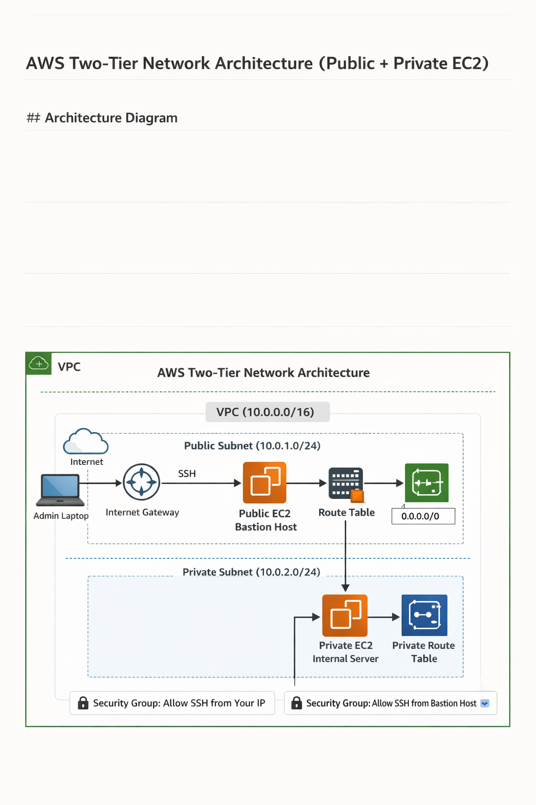

# AWS Two-Tier Network Architecture (Public + Private EC2)

## Overview

This architecture represents a **basic secure two-tier infrastructure in AWS** where resources exposed to the internet are separated from internal resources.

The design uses a **Virtual Private Cloud (VPC)** containing:

* one **public subnet**
* one **private subnet**
* a **public EC2 instance (bastion / jump host)**
* a **private EC2 instance (internal server)**

The goal of this architecture is to ensure that **only one controlled entry point from the internet exists**, while sensitive resources remain isolated inside the private network.

This pattern is commonly used in **production environments, DevOps labs, and secure cloud deployments**.

---

# Architecture Components

)

## 1. Virtual Private Cloud (VPC)

A **VPC (Virtual Private Cloud)** is a logically isolated network within AWS where all resources for this architecture are deployed.

It behaves like a **private data center network in the cloud**, allowing you to control:

* IP address ranges
* routing
* internet access
* security rules
* subnets

Example CIDR block for the VPC:

```
10.0.0.0/16
```

This means the network can contain **65,536 private IP addresses**.

Within the VPC we create **two subnets** to separate public and private workloads.

Purpose of the VPC in this architecture:

* Provides **network isolation from other AWS customers**
* Allows **fine-grained control over routing and connectivity**
* Acts as the **foundation for all networking components**

---

## 2. Public Subnet

The **public subnet** is designed for resources that must be **accessible from the internet**.

Example CIDR block:

```
10.0.1.0/24
```

A subnet becomes **public** when:

* It has a route to an **Internet Gateway**
* Instances inside it can receive **public IP addresses**

In this architecture, the public subnet contains:

**1 EC2 instance (Jump Host / Bastion Host)**

Purpose of the public subnet:

* Provide an **entry point into the VPC**
* Allow **administrators to SSH into the environment**
* Host internet-facing infrastructure if needed

Security considerations:

* Only **SSH (port 22)** is typically allowed
* Access is restricted using **security groups**

---

## 3. Private Subnet

The **private subnet** is designed for resources that **should not be accessible from the internet**.

Example CIDR block:

```
10.0.2.0/24
```

Instances in the private subnet:

* **Do not have public IP addresses**
* **Cannot be reached directly from the internet**

In this architecture it contains:

**1 EC2 instance (internal server)**

This instance is reachable **only through the public EC2 instance**.

Common workloads placed in private subnets:

* Databases
* Internal APIs
* Backend application servers
* Processing nodes

Benefits:

* Strong **security isolation**
* Reduced attack surface
* Only trusted internal traffic is allowed

---

## 4. Internet Gateway (IGW)

An **Internet Gateway** allows communication between the **VPC and the internet**.

It is attached directly to the VPC.

Without an Internet Gateway:

* instances cannot receive traffic from the internet
* public IP addresses cannot function

Role in this architecture:

The Internet Gateway enables the **public subnet EC2 instance** to:

* receive SSH connections from administrators
* send traffic to the internet if required

---

## 5. Route Tables

A **route table** controls where network traffic is directed.

Each subnet is associated with a route table.

### Public Route Table

The public subnet route table contains a rule like:

```
Destination: 0.0.0.0/0
Target: Internet Gateway
```

Meaning:
All traffic going outside the VPC is sent to the **Internet Gateway**.

This makes the subnet **public**.

### Private Route Table

The private subnet route table **does not contain a route to the Internet Gateway**.

Therefore:

* instances cannot be accessed from the internet
* only internal VPC communication works

---

## 6. Security Groups

Security Groups act as **virtual firewalls for EC2 instances**.

They control:

* inbound traffic
* outbound traffic

Each EC2 instance is attached to a security group.

### Security Group for Public EC2 (Bastion Host)

Inbound Rules:

| Protocol | Port | Source  |
| -------- | ---- | ------- |
| SSH      | 22   | Your IP |

Purpose:
Only administrators can **SSH into the bastion host**.

---

### Security Group for Private EC2

Inbound Rules:

| Protocol | Port | Source                    |
| -------- | ---- | ------------------------- |
| SSH      | 22   | Public EC2 Security Group |

Meaning:

* Only the **public EC2 instance** can connect to the private instance.

This prevents direct external access.

---

## 7. EC2 Instance in Public Subnet (Bastion Host)

The **public EC2 instance** acts as a **jump server (bastion host)**.

Characteristics:

* Has a **public IP**
* Accessible via **SSH from the internet**
* Used to access internal infrastructure

Workflow:

1. Administrator connects from laptop
2. SSH into the public EC2 instance
3. From there SSH into the private EC2

Example:

```
Laptop → Public EC2 → Private EC2
```

Benefits:

* Only **one exposed server**
* Centralized access point
* Easy auditing

---

## 8. EC2 Instance in Private Subnet

The **private EC2 instance** represents an **internal server**.

Characteristics:

* No public IP
* Cannot be accessed from the internet
* Accessible only from inside the VPC

Example uses:

* backend application server
* internal API
* database proxy
* data processing worker

Connection method:

```
SSH from Public EC2 → Private EC2
```

This ensures the server remains **fully isolated from external networks**.

---

# Traffic Flow in the Architecture

### Step 1 — Administrator Access

```
Admin Laptop
      ↓
Internet
      ↓
Internet Gateway
      ↓
Public Subnet
      ↓
Public EC2 (Bastion Host)
```

### Step 2 — Internal Access

```
Public EC2
      ↓
Private Subnet
      ↓
Private EC2
```

Direct internet access to the private EC2 **is not possible**.

---

# Security Advantages of This Architecture

### Network Isolation

Sensitive workloads remain in **private subnets**, reducing exposure.

### Controlled Entry Point

Only **one server (bastion host)** is accessible from the internet.

### Layered Security

Security is enforced at multiple layers:

* VPC
* Subnets
* Route tables
* Security groups

### Reduced Attack Surface

Attackers cannot directly reach backend systems.

---

# Real-World Use Cases

This architecture is widely used for:

* Production backend services
* Database isolation
* DevOps environments
* Secure infrastructure labs
* Jump-host based administration

Example deployment:

```
Public Subnet
   └── Bastion Host (Admin Access)

Private Subnet
   └── Application Server
```

---

# Summary

This architecture demonstrates a **secure AWS network design pattern** using:

* **1 VPC** as the isolated network
* **1 Public Subnet** for internet-facing access
* **1 Private Subnet** for protected internal services
* **Internet Gateway + Route Table** for public connectivity
* **Security Groups** to strictly control traffic
* **Public EC2 (Bastion Host)** as the entry point
* **Private EC2** for internal workloads

The result is a **simple but highly secure two-tier architecture**, ensuring that internal infrastructure remains protected while still being manageable through a controlled access point.

---
